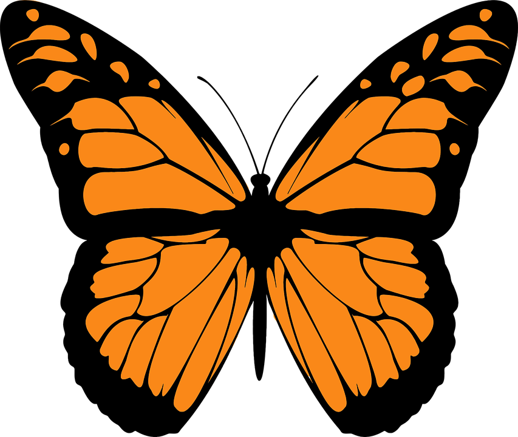

<h1 align="center">
    <!-- href to docs.rs/butterfly -->
    
     
    butterfly
     
</h1>

    LibAFL components for stateful fuzzing

    <!--
    badges:
        shields.io
            crates.io version
            (crates.io downloads)
            docs.rs quick link
            crates.io license
    -->
    

## Description
This crate brings stateful fuzzing capabilities to LibAFL via
1. __Packet-based Inputs__: Inputs that are vectors of packets and can be loaded from pcap files
2. __Packet-based Mutations__: Mutators that can be applied to selected packets only (havoc and protocol-aware mutations like packet insertion, deletion and reordering)
3. __State-Graph Inference__: Observe which states your target goes through as it processes the individual packets and identify when it enters a new state or makes a new state transition

## Installation
Dependencies:
- nightly rust
- LibAFL certain version

## How to use
see the docs or examples
