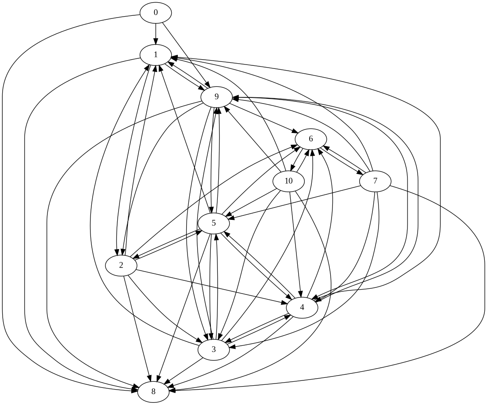

# Minimal FTP fuzzer

This example demonstrates how to setup a blackbox FTP fuzzer
with butterfly.    
It is based on the following tutorials:
- [First steps: Creating a minimal FTP fuzzer](https://github.com/fkie-cad/butterfly/wiki/First-steps:-Creating-a-minimal-FTP-fuzzer)
- [Enabling more complex mutations](https://github.com/fkie-cad/butterfly/wiki/Enabling-more-complex-mutations)
- [Loading inputs from pcap files](https://github.com/fkie-cad/butterfly/wiki/Loading-inputs-from-pcap-files)
- [Monitoring and Logging](https://github.com/fkie-cad/butterfly/wiki/Monitoring-and-Logging)

## Building
```
git submodule update --init --recursive
cd LightFTP/Source/Release
CC=clang CFLAGS='-fsanitize=address' make
cd ../../..

# Setup the FTP root
mkdir -p /tmp/ftproot/dir
echo content > /tmp/ftproot/dir/file
```

## Running
Start the FTP server
```
nohup ./LightFTP/Source/Release/fftp fuzz.conf > /dev/null &
```

Start the fuzzer
```
cargo run --release
```

Eventually, kill the server
```
killall -w fftp
```

## Results
After 50 iterations we inferred the following state graph:     
<br>

<br><br>

